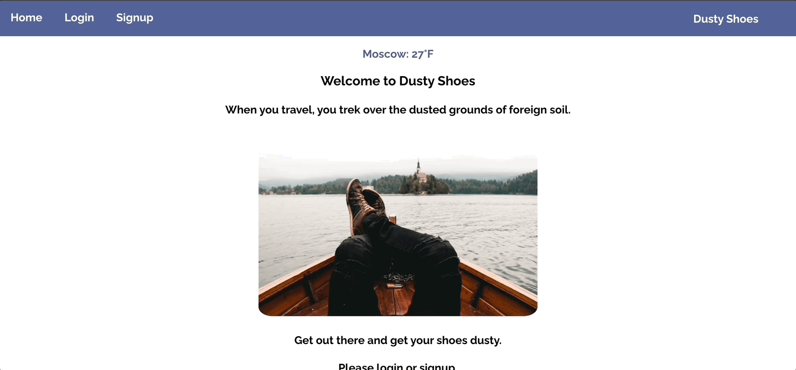
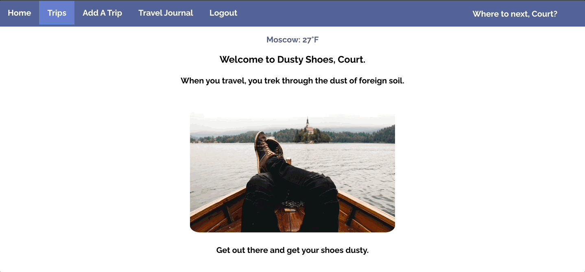
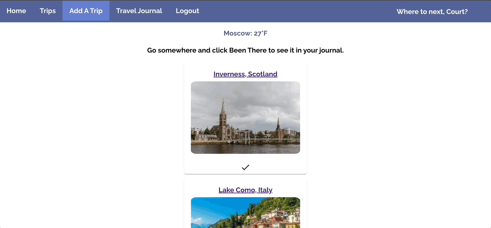
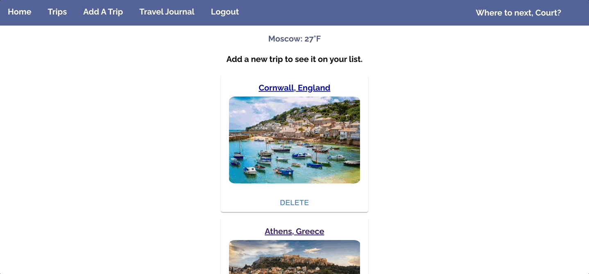

.## Table of Contents
* [Background](#background)
* [Getting Started](#getting-started-with-dusty-shoes)
* [Interaction](#how-to-interact-with-the-app)
  * [Login/Signup](#login-or-signup)
  * [View Trips](#view-trips-to-take)
  * [Add a New Trip](#add-a-new-trip)
  * [Trip Journal](#trip-journal)
  * [Add a Trip to Journal](#add-a-trip-to-journal)
* [Video Walkthrough](#video-walkthrough)
* [Technologies](#technologies-used)
* [Coming Soon](#coming-soon)
* [Code Preview](#code-preview)

[Dusty Shoes Demo Deployed](https://dusty-shoes.herokuapp.com/)

# Background

In 2019, I had planned to take my first big international trip in 2020. Well, we all know what happened in 2020, so my plans were put on the back burner for a little while. So, I created Dusty Shoes as a travel app, allowing a user to list and track the places they would like to visit.

# Getting Started with Dusty Shoes

This is a React frontend for a travel app, Dusty Shoes. Fork and clone this repository and run yarn install to get the front end up and going. Fork and clone the [backend repository](https://github.com/cmwilson21/dusty-shoes-server) and follow the README.md instructions there to get the back end going.

Once everything is ready, run yarn start to activate the app.

## How to Interact with the App

Login or signup to create an account. Once an account is created, a user will have the options to view the list of trips you'd like to take, add a new trip, or visit your journal of trips you have already taken.

### Login or Signup



### View Trips to Take



### Add a New Trip



### Trip Journal


### Add a Trip to Journal



**Note:** Under the Navbar, there is a random city displayed with current temperature.
Above the footer, there is a random travel quote displayed to help encourage your traveling spirit.

## Video Walkthrough

[Walkthrough](https://www.loom.com/share/457d278a07b942cfa2fb1712a5ada185)

## Technologies Used

- React
- Redux
- JWT Backend Auth
- Weather API
- Material UI
- Custom CSS

## Coming Soon

- Journal Feature
- Follow Users

## Code Preview

The following code is used to display which trips show up for your Trip List. First, map through the trips array and if the trip.been_there attribute is false (meaning that you have not been on the trip), it populates a card with the trip information. Otherwise, it doesn't show on the list.

```
  const tripsLi = trips.map((trip, index) => (
    <div key={index} align="center">
      {trip.been_there === false ? (
        <Grid item md={3}>
          <Card sx={{ maxWidth: 345 }} style={{ marginTop: "12px" }}>
            <CardContent>
              <NavLink to={`/trips/${trip.id}`}>
                {trip.city}, {trip.country}
              </NavLink>
              <br />
              
            </CardContent>
            <Button onClick={() => deleteTrip(trip.id)}>Delete</Button>
          </Card>
        </Grid>
      ) : (
        null
      )}
    </div>
  ))
```
